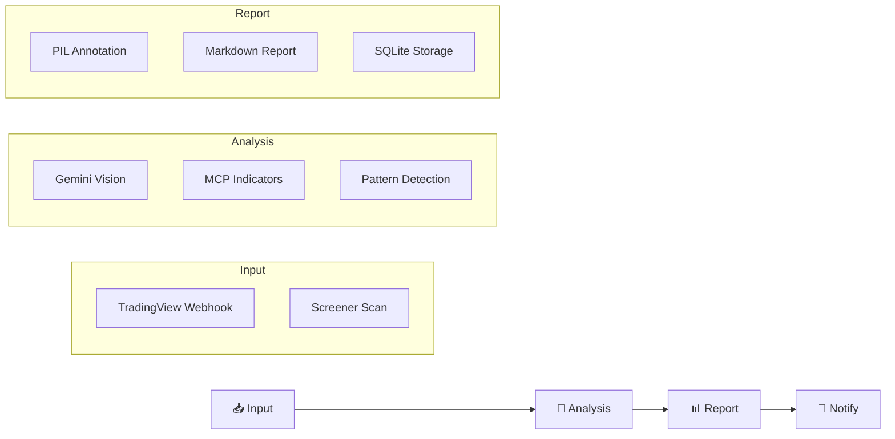

# 🤖 AI Trading Analysis Agent

> **Sistema Multi-Agente de IA para Análisis Autónomo de Trading**  
> Un analista digital incansable que prepara el trabajo para que tú tomes la decisión final.

[]()
[]()

---

## 📋 Quick Links

| Resource | Description |
|----------|-------------|
| [📚 Documentation Index](./docs/INDEX.md) | All docs with descriptions |
| [🗺️ Roadmap](./ROADMAP.md) | 4-milestone development plan |
| [⚙️ Config Example](./config/config.example.yaml) | Configuration template |

---

## 🎯 Project Vision

Build an **Autonomous Super-Analyst** that:
- ✅ Analyzes financial assets autonomously
- ✅ Generates visual reports with annotations
- ✅ Uses multimodal models (Gemini 2.0) to "see" charts
- ✅ Integrates technical + sentiment + news analysis
- ❌ **Does NOT execute trades** - Only generates viability signals

---

## 🏗️ Architecture



---

## 📁 Project Structure

```
tradingview/
├── README.md                 # This file
├── ROADMAP.md                # Development roadmap
├── .gitignore                # Git ignore rules
│
├── docs/                     # 📚 Documentation
│   ├── INDEX.md              # Documentation index
│   ├── architecture/         # Architecture docs
│   ├── research/             # Research notes
│   └── assets/               # Images & diagrams
│
├── src/                      # 💻 Source code
│   ├── agents/               # AI agents (Gemini)
│   ├── mcp_server/           # MCP tools server
│   ├── screener/             # TradingView integration
│   ├── visual/               # PIL annotation
│   └── notifier/             # Telegram notifications
│
├── config/                   # ⚙️ Configuration
│   └── config.example.yaml   # Config template
│
└── tests/                    # 🧪 Tests
```

---

## 🚀 Roadmap Overview

| Milestone | Focus | Status |
|-----------|-------|--------|
| **M1: Foundation** | Data ingestion + screener | 🔲 Pending |
| **M2: Analysis** | Gemini + pattern detection | 🔲 Pending |
| **M3: Reporting** | Visual annotation + notifications | 🔲 Pending |
| **M4: Integration** | Full pipeline + testing | 🔲 Pending |

→ See [ROADMAP.md](./ROADMAP.md) for details

---

## 🛠️ Tech Stack

| Component | Technology |
|-----------|------------|
| **Language** | Python 3.10+ |
| **Data Source** | TradingView-Screener |
| **AI Model** | Gemini 2.0 Flash |
| **Image Processing** | PIL/Pillow |
| **Structured Data** | Pydantic |
| **Database** | SQLite |
| **Notifications** | Telegram |

---

## 📊 Repository Analysis

Based on research of 4 GitHub repositories:

| Repository | Verdict | Use |
|------------|---------|-----|
| [TradingView-Screener](https://github.com/shner-elmo/TradingView-Screener) | ✅ **Use** | Core data ingestion |
| [TradingView-Webhook-Bot](https://github.com/fabston/TradingView-Webhook-Bot) | ✅ **Use** | Webhook + notification base |
| [TradingView-API](https://github.com/Mathieu2301/TradingView-API) | ⚠️ Optional | Node.js alternative |
| [Bybit-Trading-Bot](https://github.com/Mtemi/Bybit-Trading-Bot-Integrated-with-TradingView-Webhook-Alerts) | ❌ Discard | Auto-execution (not needed) |

---

## 📖 Documentation

See the [Documentation Index](./docs/INDEX.md) for:
- Architecture design documents
- Research notes and references
- Visual diagrams

---

## 📜 License

This project is for educational and research purposes.

---

> **Note for AI Agents**: This README is the project entry point. Consult [docs/INDEX.md](./docs/INDEX.md) for architecture details and [ROADMAP.md](./ROADMAP.md) for implementation priorities.
