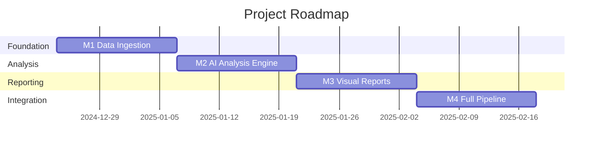

# 🗺️ ROADMAP - AI Trading Analysis Agent

> From research to a functional autonomous trading analyst.

---

## Overview



---

## 🎯 Milestone 1: Foundation (Week 1-2)

**Goal**: Establish data ingestion pipeline and basic screener functionality.

### Deliverables

| # | Task | Priority | Description |
|---|------|----------|-------------|
| 1.1 | Setup TradingView-Screener | 🔴 High | Install and test `tradingview-screener` package |
| 1.2 | Create Screener Module | 🔴 High | `src/screener/` - Basic screener with configurable filters |
| 1.3 | Define Data Models | 🟡 Medium | Pydantic models for OHLCV, indicators, signals |
| 1.4 | SQLite Database | 🟡 Medium | Schema for signals, opportunities, history |
| 1.5 | Flask Webhook Server | 🟢 Low | Base from TradingView-Webhook-Bot (optional M1) |

### Success Criteria
- [ ] Can fetch top 10 gappers from TradingView
- [ ] Can filter by volume/price criteria
- [ ] Data persists to SQLite
- [ ] Basic logging in place

---

## 🧠 Milestone 2: AI Analysis Engine (Week 3-4)

**Goal**: Integrate Gemini 2.0 for multimodal chart analysis.

### Deliverables

| # | Task | Priority | Description |
|---|------|----------|-------------|
| 2.1 | Gemini API Integration | 🔴 High | `src/agents/gemini_client.py` - Multimodal prompts |
| 2.2 | Chart Analysis Agent | 🔴 High | Visual pattern detection (Wyckoff, candlesticks) |
| 2.3 | MCP Server (Indicators) | 🟡 Medium | `src/mcp_server/` - EMA, RSI, MACD, Fibonacci |
| 2.4 | Structured Output Parser | 🟡 Medium | Pydantic schemas for analysis results |
| 2.5 | Sentiment Stub | 🟢 Low | Placeholder for future news/sentiment analysis |

### Success Criteria
- [ ] Can send chart screenshot to Gemini
- [ ] Receives structured JSON with patterns detected
- [ ] Indicators calculated correctly
- [ ] Results stored in database

---

## 📊 Milestone 3: Visual Reporting (Week 5-6)

**Goal**: Generate annotated chart images and notifications.

### Deliverables

| # | Task | Priority | Description |
|---|------|----------|-------------|
| 3.1 | PIL Annotation Module | 🔴 High | `src/visual/` - Draw zones, lines, labels |
| 3.2 | Coordinate Mapping | 🔴 High | Price→Pixel transformation for accuracy |
| 3.3 | Report Generator | 🟡 Medium | Markdown report with embedded annotated image |
| 3.4 | Telegram Notifier | 🟡 Medium | `src/notifier/` - Send reports to Telegram |
| 3.5 | Report Templates | 🟢 Low | Configurable templates for different analysis types |

### Success Criteria
- [ ] Annotated images show patterns correctly
- [ ] Reports include viability decision (Candidate/Not Candidate)
- [ ] Telegram messages received with image + summary
- [ ] Reports saved to database

---

## 🔄 Milestone 4: Full Pipeline Integration (Week 7-8)

**Goal**: Connect all components into a working end-to-end system.

### Deliverables

| # | Task | Priority | Description |
|---|------|----------|-------------|
| 4.1 | Orchestrator | 🔴 High | Main pipeline: Trigger → Analyze → Report → Notify |
| 4.2 | Configuration System | 🟡 Medium | YAML config for all parameters |
| 4.3 | Error Handling | 🟡 Medium | Graceful failures, retry logic, logging |
| 4.4 | Backtesting Hook | 🟢 Low | Log decisions for future performance analysis |
| 4.5 | Documentation | 🟢 Low | User guide, API docs, examples |

### Success Criteria
- [ ] End-to-end flow works from trigger to notification
- [ ] System runs reliably for 24+ hours
- [ ] Logs capture all decisions for backtesting
- [ ] README provides clear setup instructions

---

## 📈 Future Enhancements (Post-MVP)

| Feature | Description | Complexity |
|---------|-------------|------------|
| Sentiment Agent | News + Reddit/Twitter analysis | High |
| Whale Tracker | Large holder movement detection | High |
| Liquidation Agent | Derivatives liquidation spikes | Medium |
| Browser Use Integration | Visual navigation to TradingView | Medium |
| Multi-Asset Support | Crypto, Forex, Bonds | Low |
| Dashboard UI | Web interface for signals | High |

---

## 🚀 Quick Start (After M1)

```bash
# Install dependencies
pip install tradingview-screener google-generativeai pillow pydantic

# Configure
cp config/config.example.yaml config/config.yaml
# Edit with your API keys

# Run screener test
python -m src.screener.test
```

---

## 📋 Definition of Done

A milestone is complete when:
- ✅ All 🔴 High priority tasks are done
- ✅ Success criteria are met
- ✅ Code is documented
- ✅ Changes are committed to git
